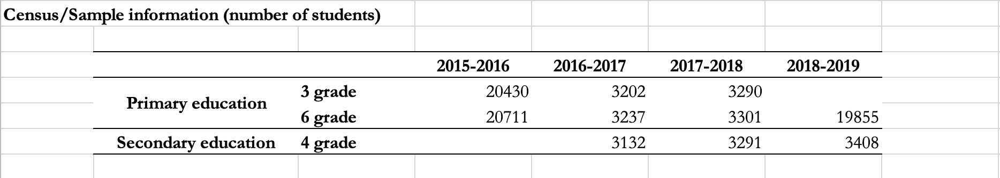
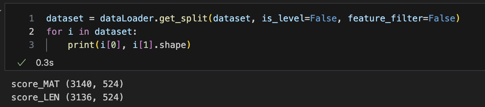
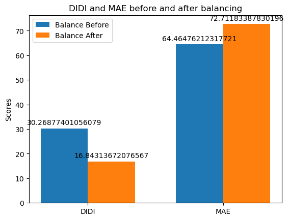
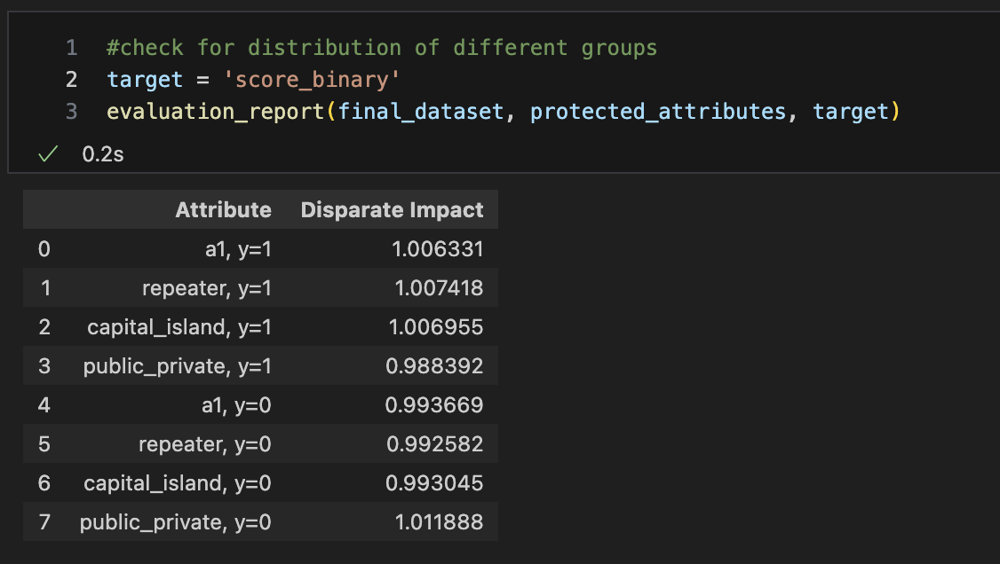

# Report

#### Excutive Summary

This project is focus on the use cases actively investigated in the Aequitas project. It consists of three tasks:

1. training a model to predict the current academic performance of the students (dependent variable) in each grade and academic year using the *student, principals, family and teachers information *(independent variables)**
2. Fairness bias
3. Missing data bias

My focus is applying techniques like **fairness through rebalancing** or **FAIRDAS** to this dataset to make it gets more fair results.

For the training, I providing several baseline models: RandomForest, Decision Tree,Gradient Boosting Regression (GBR) and Lasso Regression. the best result I get is from RandomForest, which has a average score of MAE loss 65.

The dataset is a part of the aequitas consortium, it contains information on the educational system in Canary islands. It is composed of **census** (all student population) and **sample** data on compulsory primary (third and sixth grade) and secondary (fourth grade) education students enrolled in 2015-2016, 2016-2017, 2017-2018 and 2018-2019 academic years.

The problem is almost each variable in the database has missing data. I implemented several imputation methods, like: simple_most_frequent, knn, mice and Deep Generative Modelling method. And comparing simple_most_frequent and knn methods don't change much in terms of predicting results, so I use the simple_most_frequent method for the fairness test later on.

Based on my experiments, I was able to make the dataset essentially average in distribution for each sensitive attribute, and for DIDI, essentially reduce the bias by a factor of 3 of the dataset's orignal DIDI value.

#### Background

The dataset used for training model contains **five** blocks.

* The feature blocks are: student questionnaire, school principals questionnaire, family questionnaire and teacher questionnaire.
* The target block are student **scores** in Mathematics, Spanish Language and English.

Of these, no English exams are given to third graders.

There are also so called 'Transformed variable' in the features, which is highly correlated with it's original feature, so for the efficiency, and accuracy of our model, I will remove the original features.

Cause our problem is a multi output problem(three targets column: Mathematics, Spanish Language and English). In order to reduce the complexity of fairness optimization, I will extract each target to form multiple single-target data sets like below: (target name: dataset shape)

#### System description

The fairness of the dataset is achieved by using the fairness through rebalancing codes with some modifications. There are several steps to achieve this:

1. Fix protected attributes, during this process, all sensitive attributes will be converted to binary ones.
2. Target binary, Since the dependent variable we are predicting is a continuous value, for a fair distribution, I went to the average of the dependent variable across the entire dataset as a benchmark and created a temporary new feature 'score binary' to be used for balance analysis.
3. Check for the distribution between each sensitive features and the binary target value, we we oversample each different combination to it's max frenquency.
4. For speed up for the oversampling process, I will directly use Dataframe.sample method and use random method to create new samples which is different from the initial implementation, they build the new samples one by one add to dataset.

#### Result analysis

The figure above shows the test results for a subset of the data (grade:3, year:2017, target:mathematics score), from which we can see by using our method, the Disparate Impact Difference Index of the data has been significantly reduced (almost half), and along with it, the accuracy of the model has also lost part of it. This is the so-called fairness-utility trade-off: improving disparate impact necessarily degrades accuracy.

We can also view the disparate impact of different sensitive attributes of the data set after fairness processing. It can be seen from the above figure that thedisparate impact  of each attribute is close to 1, which represents the distribution of data of different sensitive groups in our data set. is fair.
